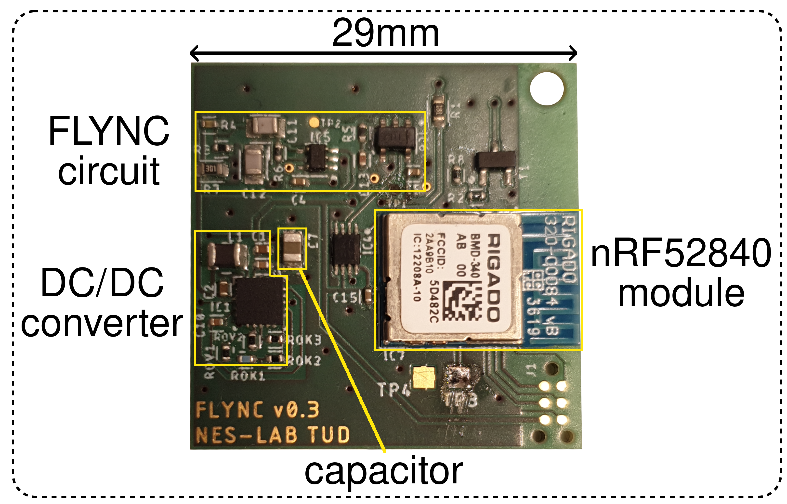
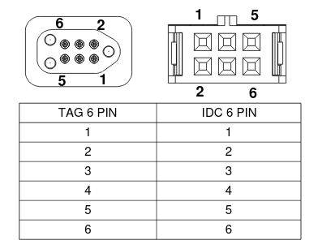

# FIND and FLYNC hardware

This directory contains the design files for a 29mm x 29mm battery-free wireless node.
The node is powered by three IXYS KXOB025-5X3F solar panels and buffers energy in a 47uF multi-layer ceramic capacitor.
It implements a circuit to extract a clock signal from variations of the solar panel current caused by powerline flicker of lamps.

Key specifications:
 - TI BQ25505 boost charger with maximum power point tracking
 - Nordic Semiconductor nRF52840 2.4GHz wireless MCU (BLE/802.15.4)
    - ARM Cortex-M4F 64MHz CPU with FPU
    - 1MB flash, 256kB S-RAM
 - 47uF capacitor in 0805 package

If you have questions or need help with manufacturing the hardware, get in touch with us!

## Pinout

We use a head-less 6-pin Tag-Connect header to break out 6 signals from the FLYNC node.

| Pin number | Signal   | Description                            |
|------------|----------|----------------------------------------|
| 1          | SWDIO    | ARM Serial Wire Debug I/O              |
| 2          | SWDCLK   | ARM Serial Wire Debug Clock            |
| 3          | PIN_DBG1 | nRF52 GPIO for debugging via e.g. UART |
| 4          | PIN_DBG2 | nRF52 GPIO for debugging via e.g. UART |
| 5          | VCC      | Output of BQ25504 and supply of nRF52  |
| 6          | GND      | Ground                                 |

Use a [Tag-Connect TC2030-IDC-NL cable](https://www.tag-connect.com/product/tc2030-idc-nl) cable to connect to this header:

## Development setup

We found the following setup convenient:

 - Lab bench power supply with 3.3V output
 - Breadboard and some jumper cables
 - [J-Link Mini Edu](https://www.segger.com/products/debug-probes/j-link/models/j-link-edu-mini/)
 - SPST push button
 - [Tag-Connect TC2030-IDC-NL cable](https://www.tag-connect.com/product/tc2030-idc-nl)

Connect the power supply GND to the breadboard GND rail and the power supply 3.3V to the breadboard power rail.
Connect GND (pin 6) of the cable to the GND rail on the breadboard and VCC (pin 5) of the cable to any unused row of the breadboard.
Connect the push button between this rail (with node VCC) and the breadboard 3.3V rail.
Connect the Vref of the J-Link to the 3.3V rail of the breadboard and the GND of the J-Link to the GND rail of the breadboard.
Finally, connect the SWDIO and SWDCLK pins of the J-Link to pins 1 and 2 of the cable.

By pushing the button, you can temporarily power the node from the 3.3V power supply to flash new code.
After releasing the push button, the node will continue to run from harvested energy.

For debugging, you can attach a logic analyzer or scope to pins 3 and 4 of the cable and an analog channel to the node's voltage rail (pin 5).
Keep in mind that there may be significant current flowing into these inputs, interfering with the node's operation.
